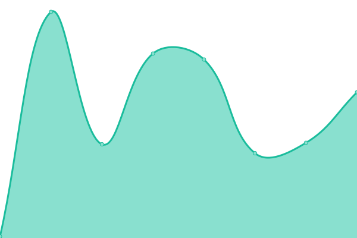
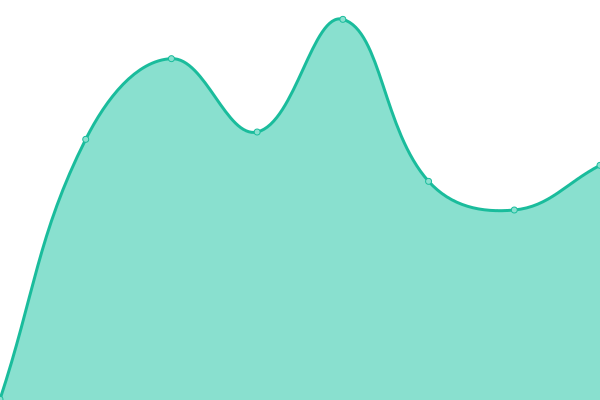
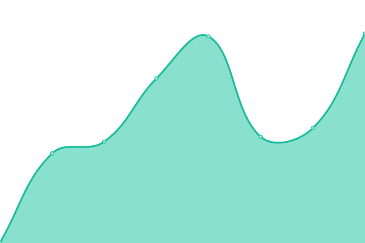
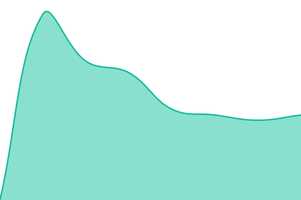

# [📈 Live Status](https://status.rmecha.my.id): <!--live status--> **🟧 Partial outage**

This repository contains the open-source uptime monitor and status page for [Ezra Khairan Permana](https://www.rmecha.my.id/), powered by [Upptime](https://github.com/upptime/upptime).

With [Upptime](https://upptime.js.org), you can get your own unlimited and free uptime monitor and status page, powered entirely by a GitHub repository. We use [Issues](https://github.com/reacto11mecha/uptime-status/issues) as incident reports, [Actions](https://github.com/reacto11mecha/uptime-status/actions) as uptime monitors, and [Pages](https://status.rmecha.my.id) for the status page.

<!--start: status pages-->
<!-- This summary is generated by Upptime (https://github.com/upptime/upptime) -->
<!-- Do not edit this manually, your changes will be overwritten -->
<!-- prettier-ignore -->
| URL | Status | History | Response Time | Uptime |
| --- | ------ | ------- | ------------- | ------ |
|  [Siakad UNJ](https://siakad.unj.ac.id/) | 🟩 Up | [siakad-unj.yml](https://github.com/reacto11mecha/uptime-status/commits/HEAD/history/siakad-unj.yml) | 

 779ms
     
 | 

<a href="https://status.rmecha.my.id/history/siakad-unj">100.00%</a>
    

|  [Sekilas 13](https://sekilas13.vercel.app) | 🟩 Up | [sekilas-13.yml](https://github.com/reacto11mecha/uptime-status/commits/HEAD/history/sekilas-13.yml) | 

 104ms
     
 | 

<a href="https://status.rmecha.my.id/history/sekilas-13">100.00%</a>
    

|  [WUNO Bot Documentation Site](https://wuno.rmecha.my.id/) | 🟥 Down | [wuno-bot-documentation-site.yml](https://github.com/reacto11mecha/uptime-status/commits/HEAD/history/wuno-bot-documentation-site.yml) | 

 0ms
     
 | 

<a href="https://status.rmecha.my.id/history/wuno-bot-documentation-site">0.00%</a>
    

|  [Web Jadwal Pelajaran](https://jadwal.rmecha.my.id/) | 🟩 Up | [web-jadwal-pelajaran.yml](https://github.com/reacto11mecha/uptime-status/commits/HEAD/history/web-jadwal-pelajaran.yml) | 

 251ms
     
 | 

<a href="https://status.rmecha.my.id/history/web-jadwal-pelajaran">100.00%</a>
    

|  [My Personal Site](https://rmecha.my.id) | 🟩 Up | [my-personal-site.yml](https://github.com/reacto11mecha/uptime-status/commits/HEAD/history/my-personal-site.yml) | 

 465ms
     
 | 

<a href="https://status.rmecha.my.id/history/my-personal-site">100.00%</a>
    

<!--end: status pages-->

[**Visit our status website →**](https://status.rmecha.my.id)

## 📄 License

- Powered by: [Upptime](https://github.com/upptime/upptime)
- Code: [MIT](./LICENSE) © [Ezra Khairan Permana](https://www.rmecha.my.id/)
- Data in the `./history` directory: [Open Database License](https://opendatacommons.org/licenses/odbl/1-0/)
